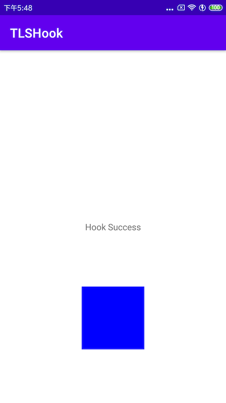

# TLSHook
Hook opengl es function call on Android by replacing TLS entry point, compatible with Android 5.x ~ 12.x

## Api
### init hook
```cpp
/**
 * init hook
 * @return success or not
 */
bool tls_hook_init();
```

### hook GL function
```cpp
/**
 * hook function
 * @param symbol: function name
 * @param new_func: function you want to replace with
 * @param old_func: origin function entry point
 * @return success or not
 */
bool tls_hook_func(const char *symbol, void *new_func, void **old_func);
```

### clear all hooks
```cpp
/**
 * clear all hooks
 */
void tls_hook_clear();
```

## Usage
```cpp
// origin function
PFNGLCLEARCOLORPROC cb_glClearColor = nullptr;

// new function
void hook_glClearColor(GLfloat red, GLfloat green, GLfloat blue, GLfloat alpha) {
  LOGD("hook call glClear: (%f, %f, %f, %f)", red, green, blue, alpha);
  if (cb_glClearColor) {
    cb_glClearColor(0.f, 0.f, 1.f, 1.f);
  }
}

// start hook
bool startHook() {
  bool success = TLSHook::tls_hook_init();
  if (success) {
    success = TLSHook::tls_hook_func("glClearColor",
                                     (void *) hook_glClearColor,
                                     (void **) &cb_glClearColor);
  }
  LOGD("hookTestStart: %s", success ? "true" : "false");
  return success ? JNI_TRUE : JNI_FALSE;
}

// stop hook
void stopHook() {
  TLSHook::tls_hook_clear();
  LOGD("hookTestStop");
}
```

in the demo app, we set the clear color of GLSurfaceView to red
```java
surfaceView.setRenderer(new GLSurfaceView.Renderer() {
    @Override
    public void onSurfaceCreated(GL10 gl, EGLConfig config) {
    }

    @Override
    public void onSurfaceChanged(GL10 gl, int width, int height) {
    }

    @Override
    public void onDrawFrame(GL10 gl) {
        GLES20.glClearColor(1.f, 0.f, 0.f, 1.f);
        GLES20.glClear(GLES20.GL_COLOR_BUFFER_BIT);
    }
});
```

but after hook `glClearColor` with
```cpp
cb_glClearColor(0.f, 0.f, 1.f, 1.f);
```

the GLSurfaceView show with color blue




## License
This code is licensed under the MIT License (see [LICENSE](LICENSE)).
